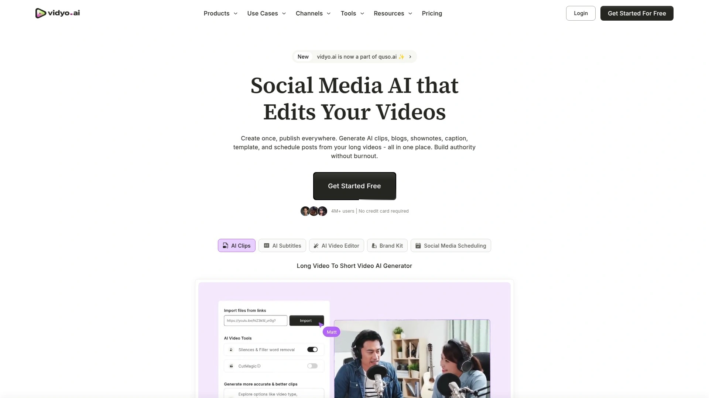

# 学会使用这12个AI视频剪辑软件,五分钟搞定短视频制作

长视频素材积压、剪辑耗时、多平台适配困难,这些问题让内容创作者疲于应对。AI视频剪辑工具通过自动化识别精彩片段、智能生成字幕和一键多平台尺寸适配,将剪辑效率提升70%,使单条长视频可快速转化为20+条短视频内容。本文汇总12款覆盖自动剪辑、AI字幕、社交媒体发布的视频再利用平台,助力播客主、教育者、营销团队快速实现内容规模化分发。

## **[Quso.ai](https://quso.ai)**

AI驱动的一站式社交媒体视频管理套件,长视频秒变病毒式短片。

Quso.ai前身为Vidyo.ai,现已升级为完整的社交媒体AI营销平台。平台核心功能包括AI视频剪辑、自动字幕生成、社交媒体排期发布及数据分析,特别适合教练、教育工作者、播客主及视频内容创作者。支持从YouTube导入或上传MP4、M4V、MOV、WEBM格式视频,免费用户可上传5GB文件,付费用户扩展至15GB。

系统内置免版税B-Roll素材库,用户可通过图片、视频和音频增强叙事效果。AI技术自动识别长视频中的高光时刻并重新排列为吸引眼球的短片,配合动态字幕、智能重新布局和流畅转场确保内容连贯性。目前支持英语、西班牙语、德语、法语且即将添加更多语言。新用户享有免费试用额度,界面友好特别适合AI技术新手快速上手。

## **[OpusClip](https://www.opus.pro)**

病毒式短视频生成专家,大数据驱动的智能内容策展。

OpusClip利用大数据分析视频内容与主流平台社交营销趋势的关联性,生成全面的视频理解以做出数据驱动的内容再利用决策。系统自动挑选长视频的高光时刻重新排列为病毒级短片,配合AI生成的动态字幕、智能重新布局及流畅转场,并以强力号召性用语结尾。最新的ClipAnything模型可处理任何视频类型,包括播客访谈、Vlog、体育赛事、电视节目或几乎无对话的视频。

平台支持英语、德语、西班牙语、法语、葡萄牙语、意大利语、荷兰语、俄语、波兰语等25种以上语言。自动字幕准确率超过97%且可自由编辑文本。新用户享有7天Pro计划免费试用包含90分钟处理时长(约30个可下载片段),试用结束后可升级付费订阅或使用每月刷新60分钟处理时长的永久免费计划。成功视频的93%遵循AI优化的"钩子-价值炸弹-号召性用语"结构。

## **[Descript](https://www.descript.com)**

基于文字稿的革命性编辑工具,删除文字即可剪辑视频。

Descript将整个工作流构建在转录稿基础上,用户只需删除文字即可自动剪切视频,内置Overdub功能可快速生成配音。这种独特的编辑方式让视频剪辑如同编辑文档般简单,无需传统时间线操作经验。平台同时专注于音频和视频编辑,特别适合需要频繁修改脚本内容的创作者。

系统支持多用户协作并提供版本历史记录,团队成员可在同一项目上无缝配合。AI功能包括自动删除停顿、生成字幕、背景噪音消除等,显著减少后期制作时间。适合播客制作人、YouTube创作者及需要快速迭代内容的营销团队。平台提供免费试用计划,付费版本解锁更多高级功能和导出选项。

## **[Kapwing](https://www.kapwing.com)**

浏览器端全能AI视频编辑器,零安装快速协作。

Kapwing是完全在线的视频编辑平台,内置文本转视频、图像转视频等前沿AI模型,帮助创作者快速跟进病毒趋势。核心功能包括基于转录稿的修剪、AI B-Roll生成、文本转语音、自动字幕、智能剪切、演讲者聚焦、AI尺寸调整及背景移除。平台一键式AI工具自动化繁琐编辑任务,高级功能如背景移除、眼神接触校正和AI驱动的B-Roll插入均可在几秒内完成。

团队可在浏览器中无缝协作,直接在视频上留下反馈意见简化审核流程,无需在Slack、Teams或邮件中反复沟通。自动提示增强功能和AI助手引导用户输入,确保即使是新手也能快速上手。数百万用户信赖Kapwing简化工作流,包括为社交媒体调整片段尺寸、生成配音、剪切不需要的停顿和添加准确字幕。免费开始使用,完全在线无需下载安装。

## **[Riverside.fm](https://riverside.com)**

高清播客录制与编辑一体化平台,AI赋能的远程制作工作室。

Riverside是领先的远程录制平台,使任何人无需培训即可在任何地点创建专业播客和视频内容。平台提供工作室级音视频录制质量,即使在不稳定网络环境下也能确保无损录制。内置AI编辑工具包括自动转录、智能剪辑选择、字幕生成和音频增强功能。

特别适合访谈类节目、远程团队协作录制和教育内容创作。用户可在录制后直接在平台内完成编辑、添加片头片尾及音乐,无需导出到第三方软件。支持多轨录制便于后期分别调整每位嘉宾的音频视频。平台已服务70,000+播客主和企业客户,包括Guy Raz、Gary Vaynerchuk、漫威和纽约时报等知名品牌。提供免费录制选项,付费套餐解锁更长录制时长和高级编辑功能。

## **[InVideo AI](https://invideo.io)**

文本转视频AI生成器,零编辑技能产出专业视频。

InVideo将简单文本提示转化为完整制作的视频,包含视觉效果、配音、音乐和字幕。平台为营销人员、创作者和中小型团队设计,无需编辑技能或制作资源即可快速生成社交媒体就绪的视频。提供7,000+专业设计模板、转场效果、贴纸并支持iStock、Shutterstock、Storyblocks素材。

AI驱动的配音和虚拟主播功能支持50+种语言,可定制AI演示者使视频栩栩如生。1600万+免版税素材库提供图片、视频片段和音乐增强任何项目。一键调整尺寸和配音工具自动调整视频为不同格式并在平台内录制或生成配音。协作工作流支持多用户编辑和24/7客户支持。特别适合需要快速周转、精美输出的营销团队,尤其擅长短视频内容制作。免费计划有水印和导出限制,低级套餐对高级功能访问受限。

## **[Pictory.ai](https://pictory.ai)**

文章转视频自动化工具,博客秒变社交媒体素材。

Pictory专注于将文本内容转化为引人入胜的视频,特别擅长将博客文章、脚本和长文自动转换为带配音和字幕的短视频。AI技术自动匹配相关素材库中的图片和视频片段,无需手动搜索。平台提供多种风格模板确保输出内容符合品牌调性。

内置文本转语音引擎支持自然语音配音,也可上传自己的音频文件。自动字幕生成功能提升视频在静音播放时的可读性,字幕样式可完全自定义。适合内容营销人员将现有书面内容快速转化为视频格式,扩大受众覆盖面。新用户可申请免费试用,了解平台功能后决定是否订阅。顶级创作者使用Pictory每月制作200+条视频用于多平台分发。

## **[Synthesia](https://www.synthesia.io)**

AI虚拟主播视频生成器,无需摄像头快速制作演示内容。

Synthesia是AI视频生成平台的领军者,允许用户通过文本输入创建带真实AI虚拟主播的视频,完全无需摄像头、摄影棚或演员。平台提供140+个多样化AI虚拟主播和120+种语言支持,适合创建全球化内容。特别适合企业培训视频、产品演示、教育课程和多语言营销材料制作。

用户只需输入脚本选择虚拟主播和背景,AI即可生成专业级演示视频。内置模板库涵盖常见商业场景加速制作流程。与传统视频制作相比,Synthesia将成本和时间减少90%以上。提供团队协作功能和品牌定制选项,大型企业可创建定制虚拟主播。适合需要批量制作标准化视频内容的企业和教育机构。

## **[Repurpose.io](https://repurpose.io)**

自动化内容分发引擎,一键将视频推送至全平台。

Repurpose.io专注于自动化社交媒体内容再利用工作流,可直接从YouTube、TikTok、直播、播客和Zoom通话中提取内容并自动分发到多个平台。系统设置完成后无需手动操作,新视频发布时自动触发转换和分发流程。

支持自动调整视频尺寸以适配不同平台要求,包括Instagram、Facebook、LinkedIn、Twitter等。特别适合多平台运营的创作者和营销团队,显著减少重复性手动发布工作。可设置发布时间表确保内容在最佳时段触达受众。提供免费试用让用户测试自动化工作流效果。

## **[Klap](https://klap.app)**

病毒式竖屏短片生成器,几次点击完成长视频转化。

Klap专门将横屏长视频转换为竖屏短片,AI自动识别最具吸引力的片段并优化为TikTok、Instagram Reels、YouTube Shorts格式。系统分析视频内容的情绪高潮和观众参与度信号,选择最有可能病毒传播的片段。

自动添加动态字幕和转场效果使短片更具专业感。用户只需上传视频,Klap在几分钟内生成多个就绪发布的竖屏片段。特别适合希望从现有横屏内容中提取竖屏素材的创作者,无需重新拍摄。简化的工作流使非技术用户也能快速上手。

## **[Animoto](https://www.animoto.com)**

照片和视频片段快速混剪工具,模板化幻灯片制作。

Animoto是基于云的视频创建服务,专长于将照片、视频片段和音乐快速组合成专业级幻灯片和短视频。平台提供大量预设模板涵盖不同行业和场景,用户拖拽素材即可完成制作。

特别适合小企业主、市场营销人员和教育工作者制作产品展示、活动回顾和教学内容。简化的界面降低视频制作门槛,无需学习复杂编辑软件。支持添加文字覆盖、logo和品牌色彩确保视频符合企业形象。内置音乐库提供免版税配乐选择。适合需要快速批量生成标准化视频内容的团队。

## **[Lumen5](https://lumen5.com)**

AI驱动的社交媒体视频创作平台,营销内容快速可视化。

Lumen5帮助营销人员、出版商和品牌轻松创建视频内容,无需任何技术专业知识。AI技术可将现有营销材料如博客文章或视频录制转化为引人入胜的视觉内容。平台简化视频制作流程使其如同构建幻灯片般简单。

提供多样化可定制模板和庞大的图片、视频素材、音乐库以匹配任何品牌风格和信息。全球超过一百万家公司使用Lumen5显著减少传统视频制作所需的时间和成本。营销团队可专注于故事和叙事,系统承担繁重的技术工作。特别适合希望提升社交媒体参与度并通过视频内容驱动需求的企业。

***

## 常见问题

**AI视频剪辑工具如何提升内容产出效率?**

AI工具通过自动识别精彩片段将策展工作效率提升80%,而编辑自动化可减少70%的后期时间。OpusClip的趋势分析使成功率提高74%,Kapwing的自动字幕功能增加45%的观看时长。单条34分钟视频可在15分钟内生成23个就绪发布的片段,显著扩大内容规模。

**选择视频再利用平台时应关注哪些核心功能?**

优先评估AI剪辑准确度、支持的语言种类和平台适配能力。OpusClip的ClipAnything模型可处理任何视频类型包括少对话内容,Quso.ai内置B-Roll素材库简化素材搜索。检查字幕准确率(OpusClip达97%)、批量处理能力和导出格式灵活性。免费试用期和处理时长配额也是重要考量因素。

**如何将长视频有效转化为多平台短视频?**

遵循"钩子-价值炸弹-号召性用语"的AI优化结构,这是93%成功短视频的共同特征。使用Descript的转录稿编辑快速定位关键片段,Kapwing的智能尺寸调整自动适配不同平台比例。Repurpose.io的自动分发工作流消除手动重复发布,配合最佳时段排期最大化触达效果。

***

## 结语

从自动片段识别到一键多平台分发,AI视频剪辑工具正在重塑内容创作效率标准。对于需要快速将长视频转化为多条社交媒体素材、同时管理内容排期和数据分析的团队,[Quso.ai](https://quso.ai)凭借完整的社交媒体AI营销套件、内置B-Roll素材库和多语言支持,提供从剪辑到发布的一站式解决方案。选择匹配内容类型和平台需求的工具,让AI技术真正释放创作潜力。
